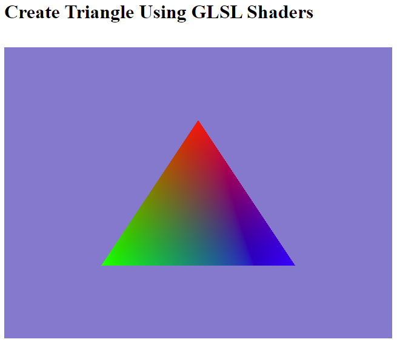

# Step-by-Step WebGPU Graphics Programming (4) 
## Create Triangle Using the GLSL Shaders 

This is the source code for the 4th part of a series YouTube videos on step-by-step WebGPU graphics programming.

This sample WebGPU app creates a triangle using the GLSL shaders. The output from the app is shown in the following image.

## Link for All Source Code Used in the WebGPU Step-By-Step Video Series:

https://github.com/jack1232/WebGPU-Step-By-Step

